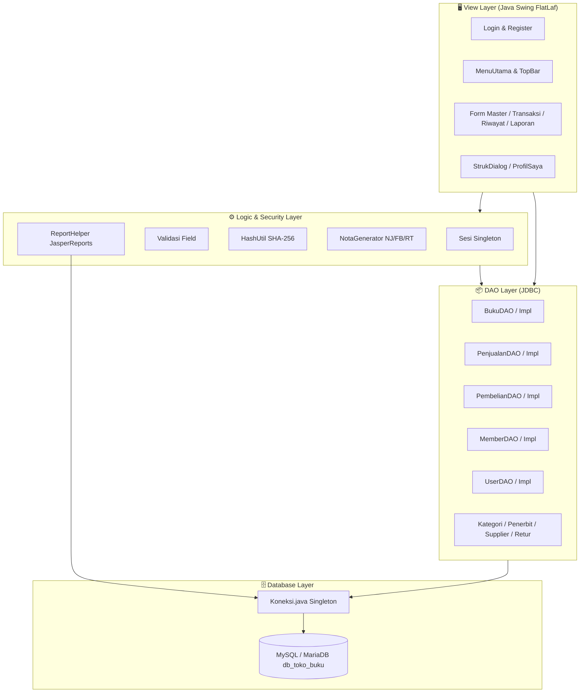

# 📚 Sistem Informasi Manajemen Toko Buku — CV Almira Jaya Abadi

<div align="center">


<p align="center">
  <b>Aplikasi Desktop Enterprise Resource Planning (ERP) & Point of Sale (POS) Toko Buku Berbasis Java Swing Modern</b>
  <br />
  <i>Dibangun dengan estetika visual Neobrutalism FlatLaf, arsitektur MVC-DAO modular, transaksi transaksional ACID, analitik JFreeChart, dan laporan profesional JasperReports.</i>
</p>

---

</div>

## 📑 Daftar Isi

- [📖 1. Tentang Proyek & Latar Belakang](#-1-tentang-proyek--latar-belakang)
- [🎯 2. Tujuan & Manfaat Sistem](#-2-tujuan--manfaat-sistem)
- [🎨 3. Desain UI Neobrutalism Modern](#-3-desain-ui-neobrutalism-modern)
- [✨ 4. Fitur Utama & Modul Sistem (Update Terbaru)](#-4-fitur-utama--modul-sistem-update-terbaru)
- [👥 5. Role & Hak Akses (RBAC Matrix)](#-5-role--hak-akses-rbac-matrix)
- [🏗️ 6. Arsitektur & Tech Stack](#️-6-arsitektur--tech-stack)
- [📁 7. Struktur Direktori Proyek](#-7-struktur-direktori-proyek)
- [💻 8. Prasyarat Sistem (Prerequisites)](#-8-prasyarat-sistem-prerequisites)
- [🛠️ 9. Panduan Instalasi & Setup Database](#️-9-panduan-instalasi--setup-database)
- [🚀 10. Cara Menjalankan Aplikasi](#-10-cara-menjalankan-aplikasi)
- [🔑 11. Kredensial Akun Default](#-11-kredensial-akun-default)
- [🧪 12. Alur Pengujian Cepat (Quick Testing Workflow)](#-12-alur-pengujian-cepat-quick-testing-workflow)
- [❓ 13. Solusi Kendala Umum (Troubleshooting & FAQ)](#-13-solusi-kendala-umum-troubleshooting--faq)
- [👨‍💻 14. Tim Pengembang & Lisensi](#-14-tim-pengembang--lisensi)

---

## 📖 1. Tentang Proyek & Latar Belakang

**Sistem Informasi Manajemen Toko Buku CV Almira Jaya Abadi** adalah sistem aplikasi desktop komprehensif yang dirancang untuk mengotomatisasi seluruh siklus operasional bisnis ritel buku. Mulai dari rantai pasok pengadaan (*supply chain purchasing*), pengelolaan katalog buku dan inventaris multi-kategori, sistem kasir kasir pintar (*Point of Sale*), manajemen keanggotaan pelanggan (*membership loyalty*), penanganan retur penjualan, hingga analitik omzet dan pelaporan laba rugi berkala.

Aplikasi ini dikembangkan untuk menggantikan pencatatan manual berbasis buku besar / spreadsheet yang rentan terhadap:
- Ketidakcocokan stok fisik buku dengan catatan penjualan.
- Kerumitan dalam menghitung potongan diskon member dan diskon grosir saat transaksi ramai.
- Ketiadaan bukti struk resmi yang cepat bagi pelanggan.
- Kesulitan dalam melacak riwayat transaksi lama dan penanganan retur buku rusak/salah.
- Lambatnya proses rekapitulasi laporan pendapatan dan laba kotor toko buku setiap akhir bulan.

---

## 🎯 2. Tujuan & Manfaat Sistem

Sistem ini didesain secara spesifik untuk memberikan dampak nyata bagi operasional toko:

1. **⚡ Efisiensi Transaksi Kasir (POS Super Cepat):**
   Mendukung pencarian buku secara instan, pemilihan kuantitas fleksibel, diskon otomatis, multi-metode pembayaran (Tunai, Transfer Bank, QRIS), dan cetak struk belanja thermal berstandar 42 karakter.
2. **📦 Kontrol Inventaris yang Akurat (ACID-Compliant):**
   Stok buku otomatis berkurang saat penjualan, otomatis bertambah saat pembelian/restock dari supplier, dan kembali pulih saat terjadi retur penjualan.
3. **📊 Visibilitas Performa Bisnis Real-Time (Executive Dashboard):**
   Menampilkan KPI harian (omzet, transaksi, item terjual, peringatan stok menipis) serta visualisasi grafik batang tren omzet 7 hari terakhir dan top 5 buku terlaris.
4. **🔒 Keamanan Berjenjang (Role-Based Access Control & Hashing):**
   Membedakan hak akses secara ketat antara **Admin** (kendali penuh seluruh modul) dan **Kasir** (terisolasi hanya untuk operasional kasir dan riwayat pribadi), serta perlindungan sandi akun dengan enkripsi SHA-256.
5. **📑 Kepatuhan Administrasi & Audit (JasperReports Engine):**
   Menyediakan 6 format laporan resmi yang dapat difilter berdasarkan rentang tanggal dan diekspor langsung ke dokumen PDF siap cetak.

---

## 🎨 3. Desain UI Neobrutalism Modern

Sistem ini mengusung bahasa visual **Neobrutalism** yang diimplementasikan di atas engine **FlatLaf**:
- **Border Hitam Tegas (2px Solid Black):** Memberikan batas kontras tinggi yang jelas antar komponen.
- **Hard Offset Shadow (Tanpa Blur):** Efek bayangan tegas khas retro-pop modern (`NeoShadowBorder`).
- **Palet Warna Segar & Berkarakter:**
  - `SURFACE`: Putih Bersih (`#FFFFFF`)
  - `BACKGROUND`: Abu-abu Lembut (`#F8F9FA`)
  - `PRIMARY ACCENT`: Kuning Cerah Pop (`#FFE600`)
  - `SECONDARY ACCENT`: Biru Lembut (`#BDE0FE`)
  - `SUCCESS`: Hijau Mint Neon (`#A3E635`)
  - `DANGER`: Merah Coral (`#F87171`)
- **Tipografi Bersih & Tegas:** Menggunakan keluarga font *Segoe UI Black* dan *Segoe UI Semibold* untuk hirarki teks yang mudah dibaca.
- **Top Bar Dinamis:** Dilengkapi jam digital *live second counter*, tanggal format bahasa Indonesia, badge status peran, dan navigasi menu *Profil Saya*.

---

## ✨ 4. Fitur Utama & Modul Sistem (Update Terbaru)

Berikut adalah rincian fungsionalitas modul-modul yang telah selesai dibangun dan teruji pada source code:

### 1. 📊 Dashboard Interaktif & Analitik Penjualan (`FormDashboard`)
- **Kartu Metrik KPI Real-Time:**
  - 💰 *Omzet Hari Ini*: Akumulasi pendapatan kotor hari ini dalam format Rupiah.
  - 🧾 *Transaksi Hari Ini*: Jumlah nota transaksi yang berhasil diselesaikan hari ini.
  - 📚 *Item Terjual Hari Ini*: Total eksemplar buku yang terjual hari ini.
  - ⚠️ *Stok Menipis*: Jumlah varian judul buku yang memiliki stok $\le 5$ pcs.
- **Visualisasi Grafik JFreeChart:**
  - 📈 *Grafik Tren Omzet 7 Hari*: Bar chart interaktif pendapatan harian selama sepekan.
  - 🏆 *Top 5 Buku Terlaris*: Horizontal bar chart peringkat buku yang paling banyak terjual bulan ini.
- **Watchlist Stok Kritis:** Tabel peringatan cepat di bagian bawah dashboard yang menampilkan daftar buku dengan stok kritis beserta tombol pengingat restock.

---

### 2. 💳 Point of Sale (POS) Penjualan Pintar (`FormPenjualan`)
- **Pencarian Buku Real-time:** Cari instan berdasarkan kode buku, judul, maupun penulis.
- **Keranjang Belanja Dinamis:** Tambah/kurang kuantitas, hapus item, dan proteksi otomatis agar kasir tidak dapat menginput kuantitas melebihi stok yang tersedia di rak.
- **Sistem Member & Diskon Otomatis:**
  - Pilihan member terdaftar dengan potongan otomatis **5%** (`AppConfig.DISKON_MEMBER_PCT`).
  - Dukungan diskon grosir untuk pembelian partai besar (syarat $\ge 50$ pcs atau nominal $\ge$ Rp 750.000).
  - Kolom input potongan manual (diskon promo khusus/spesial).
- **Multi-Metode Pembayaran:** Pilihan pembayaran fleksibel:
  - 💵 **Tunai**: Validasi nominal bayar $\ge$ total belanja dengan perhitungan kembalian otomatis.
  - 💳 **Transfer Bank**: Pembayaran non-tunai via transfer rekening.
  - 📱 **QRIS**: Pembayaran instan via barcode QRIS.
- **Penomoran Nota Unik:** Auto-generate nomor transaksi berformat `NJ-YYYYMMDD-NNNN` (contoh: `NJ-20260923-0001`).
- **Integritas Stok ACID:** Eksekusi database berbasis *transaction rollback*; jika simpan nota gagal, kuantitas stok dijamin tidak berkurang sepihak.

---

### 3. 🧾 Dialog Struk Belanja & Thermal Printing (`StrukDialog`)
- **Pratinjau Struk Kasir:** Tampilan kertas struk Neobrutalism berformat standar kasir toko buku (lebar 42 karakter).
- **Rincian Transaksi Lengkap:** Mencantumkan header toko, nama kasir bertugas, nama member (jika ada), detail item, diskon per item/total, rincian pembayaran, kembalian, dan ucapan terima kasih.
- **Dukungan Cetak Thermal Langsung:** Tombol *Cetak Struk* terhubung langsung dengan dialog pencetakan printer sistem (`java.awt.print.PrinterJob`) untuk printer kasir thermal 58mm/80mm.
- **Salin Teks Struk:** Tombol *Salin Struk* untuk mencadangkan teks struk ke clipboard sistem secara instan.

---

### 4. 📜 Riwayat Transaksi & Audit Nota (`FormRiwayat`)
- **Log Nota Penjualan:** Melihat seluruh daftar transaksi penjualan yang telah dibukukan.
- **Filter Fleksibel:** Filter rentang tanggal menggunakan kalender interaktif *LGoodDatePicker* serta pencarian cepat berdasarkan nomor nota, nama kasir, atau nama member.
- **Isolasi Role Kasir:** Jika kasir yang login membuka menu ini, sistem secara otomatis menyaring riwayat sehingga kasir hanya dapat melihat transaksi yang ditanganinya sendiri (privasi data).
- **Cetak Ulang Struk:** Klik ganda baris nota untuk membuka kembali dialog cetak struk dari transaksi yang sudah lewat.

---

### 5. 🔄 Modul Retur Buku (`FormRetur`)
- **Validasi Integritas Nota:** Kasir/Admin menginput nomor nota penjualan; sistem memverifikasi keabsahan nota dan memuat item-item yang dibeli pada nota tersebut.
- **Proteksi Kuantitas Retur:** Kuantitas buku yang diretur tidak boleh melebihi kuantitas pembelian awal.
- **Pemulihan Stok Otomatis:** Ketika retur disimpan, stok buku terkait pada database otomatis bertambah kembali ke inventaris.
- **Penomoran Retur Unik:** Auto-generate nomor dokumen retur berformat `RT-YYYYMMDD-NNNN`.

---

### 6. 📥 Pengadaan & Pembelian / Restock (`FormPembelian`)
- **Pembelian Multi-Item dari Supplier:** Pilih supplier resmi, tentukan buku yang dipesan, kuantitas beli, dan harga beli grosir.
- **Penambahan Stok Otomatis:** Menyimpan faktur pembelian akan secara otomatis menambah stok buku di sistem inventaris.
- **Penomoran Faktur Unik:** Auto-generate nomor faktur pembelian berformat `FB-YYYYMMDD-NNNN`.

---

### 7. 🗄️ Manajemen Master Data Terpadu (CRUD + Live Filter)
- **Master Buku (`FormBuku`):** Kelola kode buku, judul, pengarang, penerbit, kategori, harga beli, harga jual, dan stok awal.
- **Master Kategori (`FormKategori`):** Kelola kategori rak buku (Fiksi, Non-Fiksi, Pendidikan, Anak, Komik, dll) beserta deskripsinya.
- **Master Penerbit (`FormPenerbit`):** Kelola data rekanan penerbit buku, alamat kantor, dan kontak penanggung jawab.
- **Master Supplier (`FormSupplier`):** Kelola rekanan distributor dan grosir pemasok buku.
- **Master Member (`FormMember`):** Kelola pelanggan tetap toko untuk menikmati program loyalitas potongan harga 5%.
- **Master User (`FormUser`):** Kelola data login seluruh staf (Admin / Kasir), reset kata sandi, dan status akun (Khusus Admin).

---

### 8. 📑 6 Jenis Laporan Eksekutif JasperReports (`FormLaporan`)
Sistem terintegrasi dengan JasperReports 6.21 untuk menyusun laporan formal dengan filter periode tanggal:
1. 📘 **Laporan Data Buku:** Katalog seluruh inventaris buku, harga beli, harga jual, dan stok saat ini.
2. 💵 **Laporan Penjualan:** Rekapitulasi penjualan per rentang tanggal beserta nama kasir dan metode bayar.
3. 🚚 **Laporan Pembelian:** Rekapitulasi belanja stok ke supplier per periode.
4. ⚠️ **Laporan Stok Menipis:** Laporan prioritas restock untuk buku dengan stok di bawah ambang batas minimum.
5. 📈 **Laporan Pendapatan & Laba:** Analisis keuangan komprehensif yang menghitung laba bersih toko per periode:
   $$\text{Laba} = (\text{Harga Jual} - \text{Harga Beli}) \times \text{Qty Terjual}$$
6. 🏆 **Laporan Buku Terlaris:** Peringkat buku dengan volume penjualan tertinggi untuk mendukung keputusan pengadaan berikutnya.

> Semua laporan dapat dilihat langsung di jendela **JasperViewer** interaktif dan dapat diekspor menjadi dokumen **PDF** dengan sekali klik.

---

### 9. 🔐 Keamanan, Autentikasi & Profil Pengguna
- **Enkripsi Sandi SHA-256:** Password disimpan dalam bentuk hash heksadesimal lowercase (`util.HashUtil`), bukan plain text.
- **Registrasi Cepat Kasir (`RegisterDialog`):** Calon staf kasir dapat mendaftarkan akun secara mandiri melalui tombol "Daftar Akun Kasir" di form login, dengan peran default otomatis sebagai Kasir.
- **Dialog Profil Pengguna (`ProfilSaya`):** Pengguna yang sedang login dapat memperbarui nama lengkap dan mengubah kata sandi mereka secara langsung dari bilah atas aplikasi.
- **Manajemen Sesi Terisolasi (`Sesi.java`):** Menyimpan identitas pengguna aktif di memori aplikasi dan membersihkannya secara menyeluruh saat tombol Logout ditekan.

---

## 👥 5. Role & Hak Akses (RBAC Matrix)

Sistem membagi pengguna menjadi dua tingkat wewenang (*Role-Based Access Control*):

| Modul & Fungsionalitas | Admin | Kasir | Keterangan Batasan Akses |
|---|:---:|:---:|---|
| **Dashboard Metrik & Analisis** | ✅ | ✅ | Kasir melihat performa toko harian |
| **Master Buku** | ✅ | ❌ | Menu disembunyikan dari sidebar Kasir |
| **Master Kategori Buku** | ✅ | ❌ | Menu disembunyikan dari sidebar Kasir |
| **Master Penerbit** | ✅ | ❌ | Menu disembunyikan dari sidebar Kasir |
| **Master Supplier** | ✅ | ❌ | Menu disembunyikan dari sidebar Kasir |
| **Master Member / Pelanggan** | ✅ | ❌ | Menu disembunyikan dari sidebar Kasir |
| **Manajemen User / Staf** | ✅ | ❌ | Hanya Admin yang dapat mengelola akun |
| **Transaksi Penjualan (POS)** | ✅ | ✅ | Kasir & Admin dapat melayani kasir |
| **Cetak Struk Belanja** | ✅ | ✅ | Bebas dicetak/preview di kedua peran |
| **Transaksi Pembelian / Restock** | ✅ | ❌ | Kasir dilarang menginput faktur pembelian |
| **Transaksi Retur Buku** | ✅ | ✅ | Kasir dapat melayani retur pembeli |
| **Riwayat Nota Penjualan** | ✅ (Semua) | ✅ (Milik Sendiri) | Kasir hanya dapat melihat riwayat nota miliknya |
| **Laporan Data Buku** | ✅ | ❌ | Terkunci untuk Admin |
| **Laporan Penjualan** | ✅ (Semua) | ✅ (Milik Sendiri) | Kasir hanya mencetak laporan transaksinya |
| **Laporan Pembelian** | ✅ | ❌ | Terkunci untuk Admin |
| **Laporan Stok Menipis** | ✅ | ❌ | Terkunci untuk Admin |
| **Laporan Pendapatan & Laba** | ✅ | ❌ | Rahasia keuangan hanya untuk Admin |
| **Laporan Buku Terlaris** | ✅ | ❌ | Terkunci untuk Admin |
| **Ubah Profil & Ganti Password** | ✅ | ✅ | Dapat diakses melalui Top Bar |

---

## 🏗️ 6. Arsitektur & Tech Stack

Aplikasi dirancang menggunakan pola arsitektur berlapis **MVC (Model-View-Controller) + DAO (Data Access Object)**:



### Rincian Dependensi & Pustaka:

| Komponen | Pustaka / Teknologi | Versi | Peran dalam Proyek |
|---|---|:---:|---|
| **Bahasa Pemrograman** | Java Development Kit (JDK) | 11+ | Runtime inti aplikasi |
| **UI Look and Feel** | FormDev FlatLaf + Extras | 3.4 | Framework styling Neobrutalism |
| **Ikon Antarmuka** | Kordamp Ikonli MaterialDesign2 | 12.3.1 | Ikon vektor tajam resolusi tinggi |
| **Database Driver** | MySQL Connector/J | 8.4.0 | Jembatan komunikasi JDBC MySQL 8 |
| **Mesin Laporan** | JasperReports Core | 6.21.3 | Kompilasi & render dokumen laporan/PDF |
| **Komponen Visualisasi** | JFreeChart | 1.0.19 | Grafik batang tren omzet & buku terlaris |
| **Date Picker** | LGoodDatePicker | 11.2.1 | Komponen pemilih tanggal intuitif |
| **Build & Packaging** | Apache Maven + Shade Plugin | 3.5.1 | Standar kompilasi & pembuatan Fat JAR |

---

## 📁 7. Struktur Direktori Proyek

```text
E:\Sistem-Informasi-Manajemen-Toko-Buku\
├── 📂 database/                    # Skrip skema, migrasi, dan seed data
│   ├── 📄 db_toko_buku.sql         # Dump lengkap phpMyAdmin (skema + data siap pakai)
│   ├── 📄 schema.sql               # Skema DDL murni (11 tabel database)
│   ├── 📄 seed_demo.sql            # Data demo kaya (buku, transaksi, akun SHA-256)
│   └── 📄 migrasi_ronde3.sql       # Skrip penambahan kolom fitur POS lanjutan
├── 📂 docs/                        # Dokumentasi teknis & spesifikasi produk
│   ├── 📄 prd.md                   # Product Requirements Document (PRD)
│   └── 📄 DESIGN.md                # Panduan desain visual Neobrutalism
├── 📂 src/main/java/               # Source code utama aplikasi Java
│   ├── 📂 dao/                     # Antarmuka DAO dan implementasi JDBC
│   │   ├── BukuDAO.java / BukuDAOImpl.java
│   │   ├── PenjualanDAO.java / PenjualanDAOImpl.java
│   │   ├── PembelianDAO.java / PembelianDAOImpl.java
│   │   ├── MemberDAO.java / MemberDAOImpl.java
│   │   ├── UserDAO.java / UserDAOImpl.java
│   │   └── ... (Kategori, Penerbit, Supplier, Retur)
│   ├── 📂 koneksi/                 # Pengelola koneksi database JDBC
│   │   └── Koneksi.java            # Singleton Connection pool & URL database
│   ├── 📂 model/                   # Plain Old Java Objects (POJO) & DTO Laporan
│   │   ├── Buku.java, User.java, Penjualan.java, DetailPenjualan.java
│   │   └── LapGrafik.java, LapPenjualan.java, LapPendapatan.java, dll.
│   ├── 📂 report/                  # Helper pelaporan JasperReports
│   │   └── ReportHelper.java       # Handler compile, parameter fill, & export PDF
│   ├── 📂 util/                    # Utilitas, Keamanan, Tema, dan Konfigurasi
│   │   ├── AppConfig.java          # Parameter global (nama toko, batas diskon)
│   │   ├── HashUtil.java           # Enkripsi SHA-256 hashing
│   │   ├── Sesi.java               # State manajemen sesi pengguna aktif
│   │   ├── NotaGenerator.java      # Generator nomor dokumen transaksi otomatis
│   │   ├── NeoBrutalTheme.java     # Definisi warna, font, & styling Neobrutalism
│   │   ├── NeoShadowBorder.java    # Custom border bayangan tebal solid
│   │   └── Validasi.java           # Utilitas validasi input pengguna
│   └── 📂 view/                    # Komponen Antarmuka Grafis (Swing Forms)
│       ├── Login.java              # Form login utama
│       ├── RegisterDialog.java     # Dialog pendaftaran mandiri akun Kasir
│       ├── MenuUtama.java          # Frame utama aplikasi (Sidebar + Content Switcher)
│       ├── ProfilSaya.java         # Dialog ubah profil dan password pengguna
│       ├── FormDashboard.java      # Halaman dasbor metrik dan grafik penjualan
│       ├── FormPenjualan.java      # Halaman Point of Sale (POS) kasir
│       ├── StrukDialog.java        # Pratinjau dan pencetakan struk belanja kasir
│       ├── FormPembelian.java      # Halaman pengadaan barang dari supplier
│       ├── FormRetur.java          # Halaman retur buku bermasalah
│       ├── FormRiwayat.java        # Halaman audit dan riwayat nota transaksi
│       ├── FormLaporan.java        # Halaman filter dan preview 6 laporan
│       └── FormBuku, FormKategori, FormPenerbit, FormSupplier, FormMember, FormUser
├── 📂 src/main/resources/          # Aset non-kode aplikasi
│   ├── 📂 images/                  # Aset grafis
│   │   └── login_bg.jpg            # Ilustrasi artistik untuk panel login
│   └── 📂 reports/                 # Desain template laporan JasperReports
│       ├── lap_data_buku.jrxml
│       ├── lap_penjualan.jrxml
│       ├── lap_pembelian.jrxml
│       ├── lap_stok.jrxml
│       ├── lap_pendapatan.jrxml
│       └── lap_terlaris.jrxml
├── 📂 target/                      # Output hasil kompilasi Maven
│   └── 📦 sistem-toko-buku-1.0.0.jar # Standalone Shaded/Fat JAR siap eksekusi
├── 📄 pom.xml                      # Konfigurasi dependensi Maven & Shade plugin
├── 📄 TESTING.md                   # Catatan pengujian manual E2E aplikasi
└── 📄 README.md                    # Dokumentasi lengkap panduan proyek
```

---

## 💻 8. Prasyarat Sistem (Prerequisites)

Sebelum menginstal dan menjalankan aplikasi, pastikan perangkat Anda telah memenuhi prasyarat berikut:

1. **Sistem Operasi:** Windows 10/11, macOS, atau Linux (64-bit).
2. **Java Development Kit (JDK):** Versi **11 atau lebih baru** (JDK 17, JDK 21, atau JDK 25 didukung penuh).
   - Periksa ketersediaan Java di terminal:
     ```powershell
     java -version
     ```
3. **Database Server:** **MySQL 8.x** atau **MariaDB 10.4+** (sangat disarankan menggunakan paket bundle **XAMPP**).
4. **Build Tool (Opsional untuk compile ulang):** **Apache Maven 3.6+** (atau gunakan fitur Maven bawaan dari IDE seperti NetBeans/IntelliJ).
5. **IDE Pilihan:** **Apache NetBeans (Disarankan)**, IntelliJ IDEA, Eclipse, atau Visual Studio Code.

---

## 🛠️ 9. Panduan Instalasi & Setup Database

Ikuti langkah-langkah berikut secara berurutan untuk memasang database dan menghubungkannya dengan aplikasi:

### Langkah 1: Nyalakan Service MySQL di XAMPP
1. Buka aplikasi **XAMPP Control Panel**.
2. Pada modul **MySQL**, klik tombol **Start** hingga indikator berubah menjadi warna hijau dan port `3306` aktif.
3. *(Opsional)* Nyalakan juga modul **Apache** jika Anda ingin mengelola database lewat antarmuka web phpMyAdmin.

---

### Langkah 2: Import Database ke MySQL

Anda dapat memilih salah satu dari **dua cara** berikut:

#### ⚡ Cara A: Lewat Terminal / Command Prompt (Sangat Cepat & Direkomendasikan)
Buka terminal (PowerShell atau Command Prompt) di folder proyek:

```powershell
# 1. Buat database baru bernama db_toko_buku
mysql -u root -e "CREATE DATABASE IF NOT EXISTS db_toko_buku;"

# 2. Import dump database lengkap (skema 11 tabel + data demo siap pakai)
mysql -u root db_toko_buku < database/db_toko_buku.sql
```

> [!TIP]
> Jika perintah di atas menampilkan pesan error `mysql is not recognized`, Anda dapat menggunakan path absolut MySQL dari XAMPP, contoh:
> `C:\xampp\mysql\bin\mysql.exe -u root -e "CREATE DATABASE IF NOT EXISTS db_toko_buku;"`

---

#### 🌐 Cara B: Lewat phpMyAdmin (Antarmuka Web)
1. Buka browser Anda dan akses: `http://localhost/phpmyadmin`
2. Klik menu **Databases** (Basis Data) pada tab atas.
3. Pada kolom *Database name*, ketik: `db_toko_buku` lalu klik tombol **Create**.
4. Klik database `db_toko_buku` yang baru dibuat di bilah sebelah kiri.
5. Klik tab **Import** pada bagian atas layar.
6. Klik tombol **Choose File** (Pilih Berkas) dan arahkan ke file:
   `E:\Sistem-Informasi-Manajemen-Toko-Buku\database\db_toko_buku.sql`
7. Gulir ke bawah dan klik tombol **Import** / **Go**.
8. Pastikan pesan sukses muncul dan terdapat **11 tabel** yang terdaftar:
   `buku`, `detail_pembelian`, `detail_penjualan`, `kategori`, `member`, `pembelian`, `penerbit`, `penjualan`, `retur`, `supplier`, `users`.

---

### Penjelasan Berkas SQL di Folder `database/`:

- **`db_toko_buku.sql` (Pilihan Utama):** Dump utuh terbaru dari phpMyAdmin yang sudah mencakup skema 11 tabel, kolom penyesuaian terbaru (`metode_bayar`, `diskon`, `deskripsi`), serta data demo buku dan transaksi lengkap.
- **`schema.sql`:** Skema DDL murni 11 tabel tanpa data transaksi demo (hanya akun bawaan).
- **`seed_demo.sql`:** Kumpulan data simulasi (12 varian buku lengkap, 5 member, transaksi penjualan multi-metode, pembelian, dan retur) dengan kata sandi terenkripsi SHA-256.
- **`migrasi_ronde3.sql`:** Skrip penambahan kolom fitur POS lanjutan bagi yang telah memiliki database versi lama tanpa perlu menghapus (*drop*) data yang sudah ada.

---

### Langkah 3: Konfigurasi Parameter Koneksi JDBC
Buka file koneksi di:
[`src/main/java/koneksi/Koneksi.java`](file:///E:/Sistem-Informasi-Manajemen-Toko-Buku/src/main/java/koneksi/Koneksi.java)

Konfigurasi default bawaan telah disesuaikan dengan instalasi standar XAMPP:
```java
private static final String URL = "jdbc:mysql://localhost:3306/db_toko_buku?serverTimezone=Asia/Jakarta";
private static final String USER = "root";
private static final String PASS = "";
```

> [!NOTE]
> Jika server MySQL Anda menggunakan kata sandi kustom atau berjalan pada port selain `3306`, sesuaikan nilai konstanta `URL`, `USER`, atau `PASS` di file `Koneksi.java` tersebut.

---

## 🚀 10. Cara Menjalankan Aplikasi

Pilih salah satu metode berikut yang paling sesuai dengan lingkungan pengembangan Anda:

### 🌟 Opsi 1: Menjalankan Langsung Fat JAR Standalone (Instan Tanpa IDE)
Proyek ini sudah dilengkapi dengan file **Standalone Fat JAR** yang membungkus semua pustaka pendukung (termasuk engine JasperReports dan font ikon). Anda dapat langsung menjalankannya lewat Command Prompt / PowerShell:

```powershell
# Pastikan Anda berada di root direktori proyek:
java -jar target/sistem-toko-buku-1.0.0.jar
```

Aplikasi jendela Login berestetika Neobrutalism akan langsung terbuka di layar Anda!

---

### ☕ Opsi 2: Menjalankan Menggunakan Apache NetBeans IDE
1. Jalankan **Apache NetBeans**.
2. Klik menu **File** $\rightarrow$ **Open Project...**
3. Arahkan ke folder `E:\Sistem-Informasi-Manajemen-Toko-Buku`. NetBeans akan otomatis mengenali proyek ini sebagai **Maven Project** (memiliki ikon huruf *m* kecil).
4. Klik kanan pada nama proyek di panel *Projects* $\rightarrow$ klik **Clean and Build**.
5. Tunggu hingga status bar di kanan bawah menampilkan tulisan **BUILD SUCCESS**.
6. Klik kanan pada proyek $\rightarrow$ pilih **Run** (atau tekan tombol `F6`). Main class `view.Login` akan otomatis dipanggil.

---

### 💻 Opsi 3: Menjalankan Menggunakan IntelliJ IDEA / VS Code
- **IntelliJ IDEA:**
  1. Pilih **File** $\rightarrow$ **Open** $\rightarrow$ pilih folder proyek.
  2. Buka jendela Maven tool window di sebelah kanan, klik icon **Reload All Maven Projects**.
  3. Buka file `src/main/java/view/Login.java`, klik ikon panah hijau **Run 'Login.main()'** pada editor.
- **Visual Studio Code:**
  1. Pasang *Extension Pack for Java*.
  2. Buka folder proyek. Tunggu Language Support for Java selesai memuat.
  3. Buka file `src/main/java/view/Login.java` dan klik tombol **Run** di atas method `main`.

---

### 🔨 Opsi 4: Build Ulang Menggunakan Maven CLI (Opsional)
Jika Anda melakukan modifikasi kode dan ingin memperbarui file JAR standalone:

```powershell
# Membersihkan dan membungkus ulang seluruh modul menjadi satu JAR
mvn clean package

# Jalankan hasil kompilasi baru
java -jar target/sistem-toko-buku-1.0.0.jar
```

---

## 🔑 11. Kredensial Akun Default

Setelah mengimpor database (`db_toko_buku.sql` atau `seed_demo.sql`), Anda dapat masuk menggunakan akun berikut:

| Username | Password | Peran (Role) | Akses Fitur Utama |
|---|:---:|:---:|---|
| **`admin`** | **`admin123`** | **Admin** | Seluruh Modul: Master Data, User, Transaksi POS, Restock, Retur, 6 Laporan Lengkap |
| **`kasir`** | **`kasir123`** | **Kasir** | Modul Kasir: POS Penjualan, Retur Pelanggan, Riwayat Transaksi Pribadi, Laporan Penjualan Pribadi |

> [!IMPORTANT]
> **Catatan Keamanan Hashing:**
> Aplikasi memverifikasi kata sandi dengan fungsi hash `SHA-256`. Jika Anda memasukkan user baru secara manual via SQL, gunakan fungsi hash MySQL:
> ```sql
> INSERT INTO users (username, password, nama_lengkap, role)
> VALUES ('kasir2', SHA2('kasir123', 256), 'Kasir Shift 2', 'Kasir');
> ```
> Atau lebih mudah gunakan tombol **"Daftar Akun Kasir"** pada layar login aplikasi yang otomatis mengenkripsi kata sandi secara aman.

---

## 🧪 12. Alur Pengujian Cepat (Quick Testing Workflow)

Untuk memastikan seluruh modul berfungsi sempurna, Anda dapat mencoba skenario pengujian berikut:

### Skenario 1: Verifikasi Hak Akses & Operasional Kasir
1. Buka aplikasi, masuk dengan akun: `kasir` / `kasir123`.
2. **Periksa Sidebar:** Pastikan menu kategori *MASTER* (Buku, Kategori, Penerbit, Supplier, Member, User) dan menu *Pembelian* tidak tampil.
3. **Buka Menu Penjualan (POS):**
   - Cari buku (misal: ketik `Senja` atau kode `BK-001`).
   - Pilih member `MBR-001` (Ardiansyah Pratama) $\rightarrow$ Amati badge diskon member 5% aktif secara otomatis.
   - Tambah buku ke keranjang $\rightarrow$ Coba masukkan kuantitas melebihi stok (sistem harus menolak dengan popup peringatan).
   - Pilih metode bayar: `Tunai`, masukkan nominal bayar $\ge$ total $\rightarrow$ Klik **Simpan Transaksi**.
   - Amati jendela **Struk Dialog** muncul menampilkan format nota 42 kolom. Coba klik tombol **Salin Struk** atau **Cetak Struk**.
4. **Buka Menu Riwayat:**
   - Transaksi nota yang baru saja Anda buat akan muncul di daftar. Klik ganda baris tersebut untuk mencetak ulang struknya.
   - Perhatikan bahwa kasir hanya melihat transaksi milik akunnya sendiri.
5. **Buka Menu Laporan:**
   - Pilihan jenis laporan terkunci otomatis hanya pada opsi *Penjualan*.
6. Klik **Logout** di bagian bawah sidebar untuk kembali ke jendela login.

---

### Skenario 2: Operasional Penuh Administrator
1. Buka aplikasi, masuk dengan akun: `admin` / `admin123`.
2. **Dashboard Interaktif:** Perhatikan angka KPI omzet dan transaksi bertambah sesuai penjualan yang dilakukan kasir tadi. Amati grafik JFreeChart yang terisi secara dinamis.
3. **Master Data:** Buka menu **Buku**, coba tambah data judul buku baru, edit harganya, atau lakukan pencarian live.
4. **Pembelian / Restock:** Buka menu **Pembelian**, pilih supplier, pilih buku, tentukan jumlah stok yang dipasok, dan klik Simpan. Kembali ke master buku untuk memverifikasi stoknya telah bertambah.
5. **Retur Barang:** Buka menu **Retur**, ketik nomor nota penjualan kasir sebelumnya. Pilih buku yang ingin diretur, isi kuantitas dan alasan $\rightarrow$ Klik Simpan. Verifikasi stok buku di master bertambah kembali.
6. **Pelaporan Eksekutif:** Buka menu **Laporan**, pilih jenis laporan **Pendapatan & Laba**, tentukan rentang tanggal, lalu klik **Tampilkan** (JasperViewer akan terbuka) atau klik **Export PDF** (pilih lokasi penyimpanan file PDF di komputer Anda).

---

## ❓ 13. Solusi Kendala Umum (Troubleshooting & FAQ)

### 🔴 Kendala 1: `Communications link failure` / `Connection refused`
- **Penyebab:** Service MySQL di XAMPP belum aktif, atau port MySQL bukan `3306`.
- **Solusi:**
  1. Buka XAMPP Control Panel, pastikan modul MySQL sudah berstatus **Running** (warna hijau).
  2. Periksa port MySQL di XAMPP. Jika berjalan di port lain (misal `3307`), ubah konstanta `URL` pada `Koneksi.java` menjadi:
     `jdbc:mysql://localhost:3307/db_toko_buku?...`

---

### 🔴 Kendala 2: `Table 'db_toko_buku.users' doesn't exist`
- **Penyebab:** Database `db_toko_buku` belum dibuat atau file SQL belum diimpor.
- **Solusi:** Jalankan kembali langkah impor database dari terminal atau phpMyAdmin sesuai panduan di [Bagian 9](#️-9-panduan-instalasi--setup-database).

---

### 🔴 Kendala 3: Gagal Login padahal Username & Password Benar
- **Penyebab:** Anda hanya mengimpor `schema.sql` lama yang berisi password plain text, sementara aplikasi memvalidasi hash SHA-256.
- **Solusi:** Jalankan query perbaikan berikut di SQL tab phpMyAdmin atau terminal:
  ```sql
  UPDATE users SET password = SHA2('admin123', 256) WHERE username = 'admin';
  ```
  Atau import file `database/seed_demo.sql` / `database/db_toko_buku.sql`.

---

### 🔴 Kendala 4: Gambar Latar Belakang Login Tidak Tampil
- **Penyebab:** Path gambar tidak ditemukan saat dipanggil dari environment custom.
- **Solusi:** Sistem sudah memiliki mekanisme *graceful fallback*. Jika file `src/main/resources/images/login_bg.jpg` tidak terdeteksi, panel kiri login akan otomatis beralih menampilkan ikon vektor buku dan palet warna Neobrutalism yang elegan tanpa menyebabkan aplikasi crash.

---

### 🔴 Kendala 5: Ekspor Laporan PDF Gagal atau Error JasperReports
- **Penyebab:** Folder tujuan ekspor tidak memiliki hak akses tulis (*write permissions*) atau pustaka dependency shade bentrok.
- **Solusi:**
  1. Pastikan Anda memilih folder penyimpanan yang memiliki hak akses penuh (misal: folder `Documents` atau `Desktop`).
  2. Gunakan file executable standalone yang telah dipaketkan di `target/sistem-toko-buku-1.0.0.jar` yang telah teruji 100% kompatibel mengekspor PDF di luar IDE.

---

## 👨‍💻 14. Tim Pengembang & Lisensi

Proyek ini dikembangkan sebagai karya **Kuliah Kerja Praktik (KKP) Sistem Informasi** untuk digitalisasi operasional retail buku:

- **Instansi Mitra:** Toko Buku CV Almira Jaya Abadi
- **Arsitektur & Pengembangan:** Tim Mahasiswa Pengembang Sistem Informasi
- **Lisensi:** *Academic & Proprietary Use* untuk CV Almira Jaya Abadi. Seluruh kode sumber terbuka untuk keperluan evaluasi akademik dan pembelajaran.

---

<div align="center">
  <b>⭐ Jangan lupa berikan bintang pada repositori ini jika bermanfaat! ⭐</b>
  <br>
  <i>Built with passion, coffee, and clean Java code.</i>
</div>
