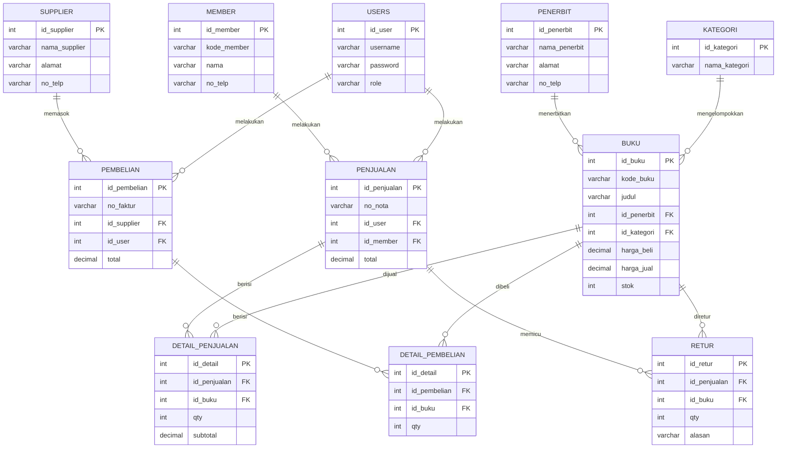
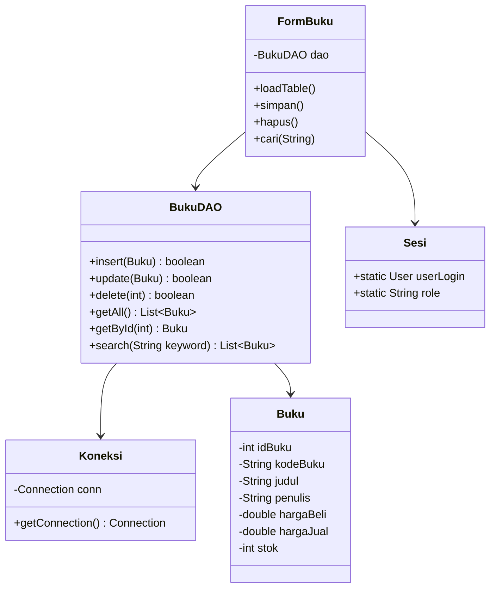
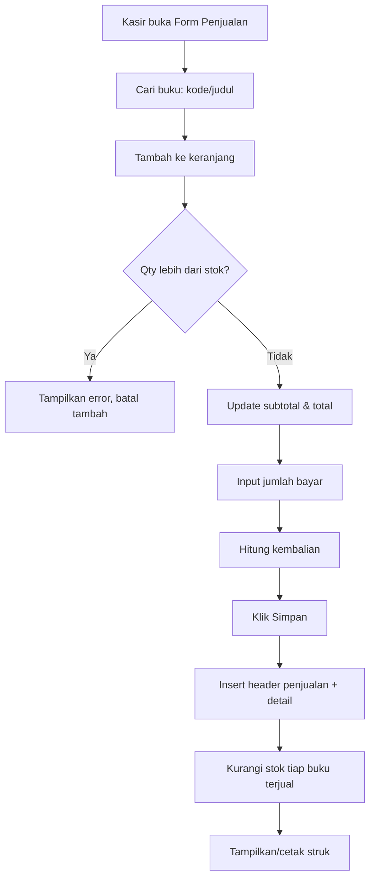
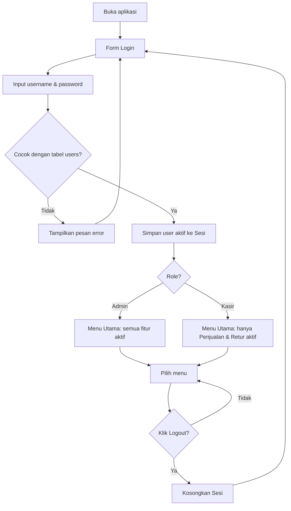
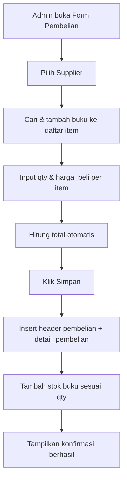
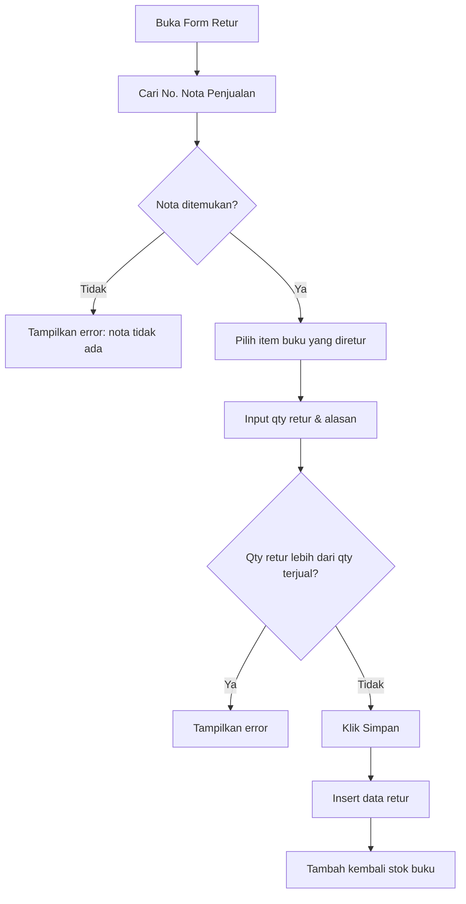
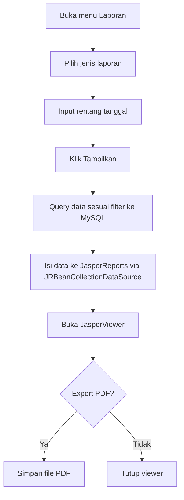
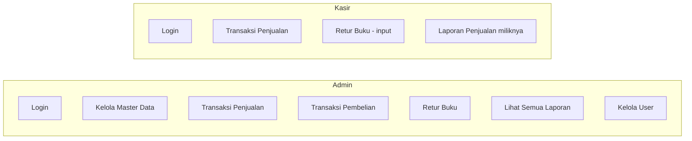
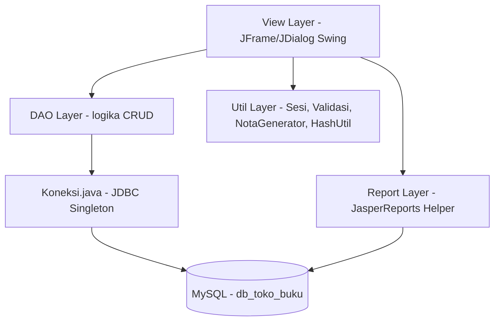

# PRD — Sistem Informasi Manajemen Penjualan Toko Buku

**Dokumen ini adalah instruksi kerja untuk AI coding agent (OpenCode).** Ikuti fase secara berurutan. Jangan lompat ke fase berikutnya sebelum semua item **Definition of Done (DoD)** pada fase sebelumnya tercentang. Setiap fase harus menghasilkan kode yang bisa di-compile dan dijalankan di NetBeans.

---

## 1. Ringkasan Proyek

| | |
|---|---|
| Judul | Perancangan Sistem Informasi Manajemen Penjualan Toko Buku [Nama Toko] |
| Jenis | Aplikasi desktop (KKP — Kuliah Kerja Praktik) |
| Platform | Java Swing, dijalankan & dites di NetBeans |
| Database | MySQL via XAMPP |
| UI Look & Feel | FlatLaf, dikustom jadi gaya **Neobrutalism** (lihat `DESIGN.md`) |
| Reporting | JasperReports (desain via Jaspersoft Studio) |
| Role | Admin, Kasir |

---

## 2. Tech Stack & Dependencies

- **Java** 11+ (Swing, tanpa framework UI tambahan selain FlatLaf)
- **NetBeans** — buka sebagai **Maven Project** (bukan Ant), pakai GUI Builder (Matisse) atau custom-coded Swing, boleh keduanya dicampur per form
- **Build**: Maven. Semua dependency didaftarkan di `pom.xml`, bukan JAR manual di folder `lib/`. Struktur folder ikut standar Maven: `src/main/java`, `src/main/resources`.
- **`pom.xml`** (taruh di root project, ini daftar dependency final yang dipakai):

```xml
<project xmlns="http://maven.apache.org/POM/4.0.0">
    <modelVersion>4.0.0</modelVersion>
    <groupId>com.tokobuku</groupId>
    <artifactId>sistem-toko-buku</artifactId>
    <version>1.0.0</version>
    <packaging>jar</packaging>

    <properties>
        <maven.compiler.source>11</maven.compiler.source>
        <maven.compiler.target>11</maven.compiler.target>
        <project.build.sourceEncoding>UTF-8</project.build.sourceEncoding>
    </properties>

    <dependencies>
        <!-- UI Look & Feel -->
        <dependency>
            <groupId>com.formdev</groupId>
            <artifactId>flatlaf</artifactId>
            <version>3.4</version>
        </dependency>
        <dependency>
            <groupId>com.formdev</groupId>
            <artifactId>flatlaf-extras</artifactId>
            <version>3.4</version>
        </dependency>

        <!-- Icon set -->
        <dependency>
            <groupId>org.kordamp.ikonli</groupId>
            <artifactId>ikonli-swing</artifactId>
            <version>12.3.1</version>
        </dependency>
        <dependency>
            <groupId>org.kordamp.ikonli</groupId>
            <artifactId>ikonli-materialdesign2-pack</artifactId>
            <version>12.3.1</version>
        </dependency>

        <!-- Database -->
        <dependency>
            <groupId>com.mysql</groupId>
            <artifactId>mysql-connector-j</artifactId>
            <version>8.4.0</version>
        </dependency>

        <!-- Reporting -->
        <dependency>
            <groupId>net.sf.jasperreports</groupId>
            <artifactId>jasperreports</artifactId>
            <version>6.21.3</version>
        </dependency>

        <!-- Date picker untuk filter laporan -->
        <dependency>
            <groupId>com.github.lgooddatepicker</groupId>
            <artifactId>LGoodDatePicker</artifactId>
            <version>11.2.1</version>
        </dependency>
    </dependencies>

    <build>
        <plugins>
            <!-- Bundle semua dependency jadi satu JAR yang bisa dijalankan langsung -->
            <plugin>
                <groupId>org.apache.maven.plugins</groupId>
                <artifactId>maven-shade-plugin</artifactId>
                <version>3.5.1</version>
                <executions>
                    <execution>
                        <phase>package</phase>
                        <goals><goal>shade</goal></goals>
                        <configuration>
                            <transformers>
                                <transformer implementation="org.apache.maven.plugins.shade.resource.ManifestResourceTransformer">
                                    <mainClass>view.Login</mainClass>
                                </transformer>
                            </transformers>
                        </configuration>
                    </execution>
                </executions>
            </plugin>
        </plugins>
    </build>
</project>
```

> Ganti `<mainClass>view.Login</mainClass>` sesuai nama class Form Login yang benar-benar dibuat di Fase 2. Versi dependency di atas boleh disesuaikan agent ke versi stabil terbaru saat build, selama tetap dalam major version yang sama.

---

## 3. Setup Database (WAJIB dijalankan agent via terminal)

1. Pastikan MySQL service XAMPP jalan.
2. Buat database dan import schema langsung dari terminal:

```bash
mysql -u root -e "CREATE DATABASE IF NOT EXISTS db_toko_buku;"
mysql -u root db_toko_buku < database/schema.sql
```

3. Simpan SQL di bawah ini sebagai `database/schema.sql` di root project sebelum menjalankan command di atas.

```sql
CREATE TABLE users (
    id_user INT AUTO_INCREMENT PRIMARY KEY,
    username VARCHAR(50) UNIQUE NOT NULL,
    password VARCHAR(255) NOT NULL,
    nama_lengkap VARCHAR(100) NOT NULL,
    role ENUM('Admin','Kasir') NOT NULL,
    created_at TIMESTAMP DEFAULT CURRENT_TIMESTAMP
);

CREATE TABLE kategori (
    id_kategori INT AUTO_INCREMENT PRIMARY KEY,
    nama_kategori VARCHAR(50) NOT NULL
);

CREATE TABLE penerbit (
    id_penerbit INT AUTO_INCREMENT PRIMARY KEY,
    nama_penerbit VARCHAR(100) NOT NULL,
    alamat VARCHAR(255),
    no_telp VARCHAR(20)
);

CREATE TABLE supplier (
    id_supplier INT AUTO_INCREMENT PRIMARY KEY,
    nama_supplier VARCHAR(100) NOT NULL,
    alamat VARCHAR(255),
    no_telp VARCHAR(20)
);

CREATE TABLE member (
    id_member INT AUTO_INCREMENT PRIMARY KEY,
    kode_member VARCHAR(20) UNIQUE,
    nama VARCHAR(100) NOT NULL,
    alamat VARCHAR(255),
    no_telp VARCHAR(20)
);

CREATE TABLE buku (
    id_buku INT AUTO_INCREMENT PRIMARY KEY,
    kode_buku VARCHAR(20) UNIQUE NOT NULL,
    judul VARCHAR(150) NOT NULL,
    penulis VARCHAR(100),
    id_penerbit INT,
    id_kategori INT,
    harga_beli DECIMAL(10,2) NOT NULL DEFAULT 0,
    harga_jual DECIMAL(10,2) NOT NULL DEFAULT 0,
    stok INT NOT NULL DEFAULT 0,
    created_at TIMESTAMP DEFAULT CURRENT_TIMESTAMP,
    FOREIGN KEY (id_penerbit) REFERENCES penerbit(id_penerbit),
    FOREIGN KEY (id_kategori) REFERENCES kategori(id_kategori)
);

CREATE TABLE penjualan (
    id_penjualan INT AUTO_INCREMENT PRIMARY KEY,
    no_nota VARCHAR(30) UNIQUE NOT NULL,
    tanggal DATETIME NOT NULL,
    id_user INT NOT NULL,
    id_member INT NULL,
    total DECIMAL(12,2) NOT NULL DEFAULT 0,
    bayar DECIMAL(12,2) NOT NULL DEFAULT 0,
    kembalian DECIMAL(12,2) NOT NULL DEFAULT 0,
    FOREIGN KEY (id_user) REFERENCES users(id_user),
    FOREIGN KEY (id_member) REFERENCES member(id_member)
);

CREATE TABLE detail_penjualan (
    id_detail INT AUTO_INCREMENT PRIMARY KEY,
    id_penjualan INT NOT NULL,
    id_buku INT NOT NULL,
    qty INT NOT NULL,
    harga_jual DECIMAL(10,2) NOT NULL,
    subtotal DECIMAL(12,2) NOT NULL,
    FOREIGN KEY (id_penjualan) REFERENCES penjualan(id_penjualan),
    FOREIGN KEY (id_buku) REFERENCES buku(id_buku)
);

CREATE TABLE pembelian (
    id_pembelian INT AUTO_INCREMENT PRIMARY KEY,
    no_faktur VARCHAR(30) UNIQUE NOT NULL,
    tanggal DATETIME NOT NULL,
    id_supplier INT NOT NULL,
    id_user INT NOT NULL,
    total DECIMAL(12,2) NOT NULL DEFAULT 0,
    FOREIGN KEY (id_supplier) REFERENCES supplier(id_supplier),
    FOREIGN KEY (id_user) REFERENCES users(id_user)
);

CREATE TABLE detail_pembelian (
    id_detail INT AUTO_INCREMENT PRIMARY KEY,
    id_pembelian INT NOT NULL,
    id_buku INT NOT NULL,
    qty INT NOT NULL,
    harga_beli DECIMAL(10,2) NOT NULL,
    subtotal DECIMAL(12,2) NOT NULL,
    FOREIGN KEY (id_pembelian) REFERENCES pembelian(id_pembelian),
    FOREIGN KEY (id_buku) REFERENCES buku(id_buku)
);

CREATE TABLE retur (
    id_retur INT AUTO_INCREMENT PRIMARY KEY,
    no_retur VARCHAR(30) UNIQUE NOT NULL,
    tanggal DATETIME NOT NULL,
    id_penjualan INT NOT NULL,
    id_buku INT NOT NULL,
    qty INT NOT NULL,
    alasan VARCHAR(255),
    FOREIGN KEY (id_penjualan) REFERENCES penjualan(id_penjualan),
    FOREIGN KEY (id_buku) REFERENCES buku(id_buku)
);

INSERT INTO users (username, password, nama_lengkap, role)
VALUES ('admin', 'admin123', 'Administrator', 'Admin');
```

> Catatan: `password` disimpan hash (BCrypt/SHA-256) di kode Java, bukan plain text — baris `INSERT` di atas cuma seed awal untuk development, agent wajib hash sebelum insert user baru dari aplikasi.

---

## 4. Struktur Package

Ikut struktur standar Maven (`src/main/java` untuk kode, `src/main/resources` untuk aset non-kode):

```
sistem-toko-buku/
 ├─ pom.xml
 ├─ database/
 │   └─ schema.sql
 └─ src/main/
     ├─ java/
     │   ├─ koneksi/     → Koneksi.java (singleton JDBC connection)
     │   ├─ model/       → POJO tiap entity (Buku, User, Penjualan, dst)
     │   ├─ dao/         → interface + implementasi CRUD tiap entity
     │   ├─ view/         → semua JFrame/JDialog (Login, MenuUtama, FormBuku, dst)
     │   ├─ util/         → Sesi.java, Validasi.java, HashUtil.java, NotaGenerator.java
     │   └─ report/       → helper pemanggil JasperReports
     └─ resources/
         ├─ images/       → login_illustration.svg / login_bg.jpg (lihat DESIGN.md §7)
         └─ reports/      → file .jrxml untuk 6 laporan
```

---

## 5. Role & Akses

| Fitur | Admin | Kasir |
|---|---|---|
| Master Buku/Kategori/Penerbit/Supplier/Member | ✅ | ❌ |
| Transaksi Penjualan (POS) | ✅ | ✅ |
| Transaksi Pembelian/Restock | ✅ | ❌ |
| Retur Buku | ✅ | ✅ (input saja) |
| Semua Laporan | ✅ | ❌ (hanya Laporan Penjualan miliknya) |
| Manajemen User | ✅ | ❌ |

---

## 6. Fitur & Form

### Master
1. **Form Buku** — kode_buku, judul, penulis, penerbit (combo), kategori (combo), harga_beli, harga_jual, stok
2. **Form Kategori Buku** — nama_kategori
3. **Form Penerbit** — nama, alamat, no_telp
4. **Form Supplier** — nama, alamat, no_telp
5. **Form Member/Pelanggan** — kode_member, nama, alamat, no_telp

### Transaksi
6. **Form Transaksi Penjualan (POS)** — cari buku, keranjang (JTable), auto hitung subtotal/total, input bayar, hitung kembalian, simpan → kurangi stok, cetak struk
7. **Form Transaksi Pembelian/Restock** — pilih supplier, tambah item buku + qty + harga_beli, simpan → tambah stok
8. **Form Retur Buku** — pilih nota penjualan, pilih item, qty retur, alasan, simpan → stok kembali bertambah

### Report (JasperReports, filter tanggal)
1. Laporan Data Buku
2. Laporan Penjualan (per periode)
3. Laporan Pembelian/Restock
4. Laporan Stok Buku (termasuk stok menipis)
5. Laporan Pendapatan & Keuntungan (`(harga_jual - harga_beli) × qty`)
6. Laporan Buku Terlaris (top selling per periode)

---

## 7. Fase Pengerjaan & Definition of Done

### Fase 0 — Setup Environment
- [ ] `pom.xml` dibuat dengan semua dependency di §2, `mvn clean compile` sukses tanpa error
- [ ] Project dibuka di NetBeans sebagai **Maven Project** (File → Open Project, terdeteksi otomatis dari `pom.xml`), bukan Ant project
- [ ] Compile & run tampil JFrame kosong tanpa error (via NetBeans Run atau `mvn exec:java`)
- [ ] `database/schema.sql` dibuat dan berhasil di-import (`SHOW TABLES;` menampilkan 11 tabel)
- [ ] `Koneksi.java` berhasil connect ke `db_toko_buku` (test print "Connected" di console)

### Fase 1 — Layer Model & DAO
- [ ] Semua model POJO dibuat sesuai kolom tabel
- [ ] Setiap entity punya DAO dengan method `insert`, `update`, `delete`, `getAll`, `getById`, `search`
- [ ] Semua method DAO tested manual (bisa lewat `main()` sementara) tanpa exception terhadap DB

### Fase 2 — Login & Role
- [ ] Form Login (neobrutalism style) berhasil autentikasi terhadap tabel `users`, password di-hash
- [ ] Login salah menampilkan pesan error, tidak lanjut ke menu
- [ ] `Sesi.java` menyimpan user & role setelah login sukses
- [ ] Menu Utama (MDI/JTabbedPane/sidebar) menampilkan/menyembunyikan menu sesuai tabel role di §5
- [ ] Logout mengosongkan sesi dan kembali ke Form Login

### Fase 3 — Form Master (Buku, Kategori, Penerbit, Supplier, Member)
Untuk **setiap** form master:
- [ ] Tabel data (JTable) ter-load dari DB saat form dibuka
- [ ] Tambah data — validasi field wajib, muncul di tabel setelah simpan
- [ ] Edit data — klik baris tabel isi ke form, update tersimpan ke DB
- [ ] Hapus data — konfirmasi dialog sebelum delete
- [ ] Search/filter di atas tabel berfungsi live

### Fase 4 — Transaksi
**Form Penjualan (POS):**
- [ ] Cari buku (kode/judul) dan tambah ke keranjang
- [ ] Qty tidak boleh melebihi stok tersedia (validasi + pesan error)
- [ ] Total, bayar, kembalian terhitung otomatis dan benar
- [ ] No. nota auto-generate & unik (format contoh: `NJ-20260923-0001`)
- [ ] Simpan → insert header + detail, stok buku berkurang sesuai qty terjual
- [ ] Struk bisa di-preview/cetak (minimal JDialog berisi ringkasan transaksi)

**Form Pembelian/Restock:**
- [ ] Pilih supplier, tambah item buku + qty + harga_beli
- [ ] No. faktur auto-generate & unik
- [ ] Simpan → insert header + detail, stok buku bertambah

**Form Retur:**
- [ ] Retur hanya bisa dari nota penjualan yang valid
- [ ] Qty retur tidak boleh melebihi qty yang terjual di nota tsb
- [ ] Simpan → stok buku bertambah kembali

### Fase 5 — Laporan (JasperReports)
- [ ] Semua 6 laporan di §6 punya file `.jrxml` dan bisa dipanggil dari menu masing-masing
- [ ] Setiap laporan punya filter rentang tanggal (kecuali Laporan Data Buku)
- [ ] `JasperViewer` terbuka menampilkan data sesuai filter, tanpa error
- [ ] Laporan bisa export ke PDF dari toolbar viewer

### Fase 6 — Finalisasi UI Neobrutalism
- [ ] Tema FlatLaf custom (lihat `DESIGN.md`) diterapkan di seluruh form, bukan cuma sebagian
- [ ] Tidak ada komponen Swing default (tombol abu-abu polos, border tipis standar) yang tersisa
- [ ] Konsisten: warna, font, border tebal, shadow offset di semua screen

### Fase 7 — Testing & Packaging
- [ ] Semua alur (login → CRUD master → transaksi → laporan → logout) dites manual tanpa crash
- [ ] `mvn clean package` menghasilkan JAR standalone (hasil `maven-shade-plugin`) yang bisa jalan (`java -jar target/sistem-toko-buku-1.0.0.jar`) di luar IDE
- [ ] `database/schema.sql` final disertakan di project
- [ ] `README.md` berisi langkah setup XAMPP, import DB, dan run aplikasi

---

## 8. Diagram

### 8.1 Entity Relationship Diagram



### 8.2 Class Diagram (pola MVC + DAO, contoh modul Buku)



### 8.3 Flow Transaksi Penjualan (POS)



### 8.4 Flow Login & Akses Role



### 8.5 Flow Transaksi Pembelian / Restock



### 8.6 Flow Retur Buku



### 8.7 Flow Generate Laporan



### 8.8 Use Case per Role



### 8.9 Arsitektur Sistem (Layered)



---

## 9. Deliverable Akhir

- Source code lengkap (NetBeans Maven project + `pom.xml`)
- `database/schema.sql`
- File `.jrxml` untuk 6 laporan
- `README.md` (setup & run instructions)
- JAR hasil `mvn package` (`target/`)
